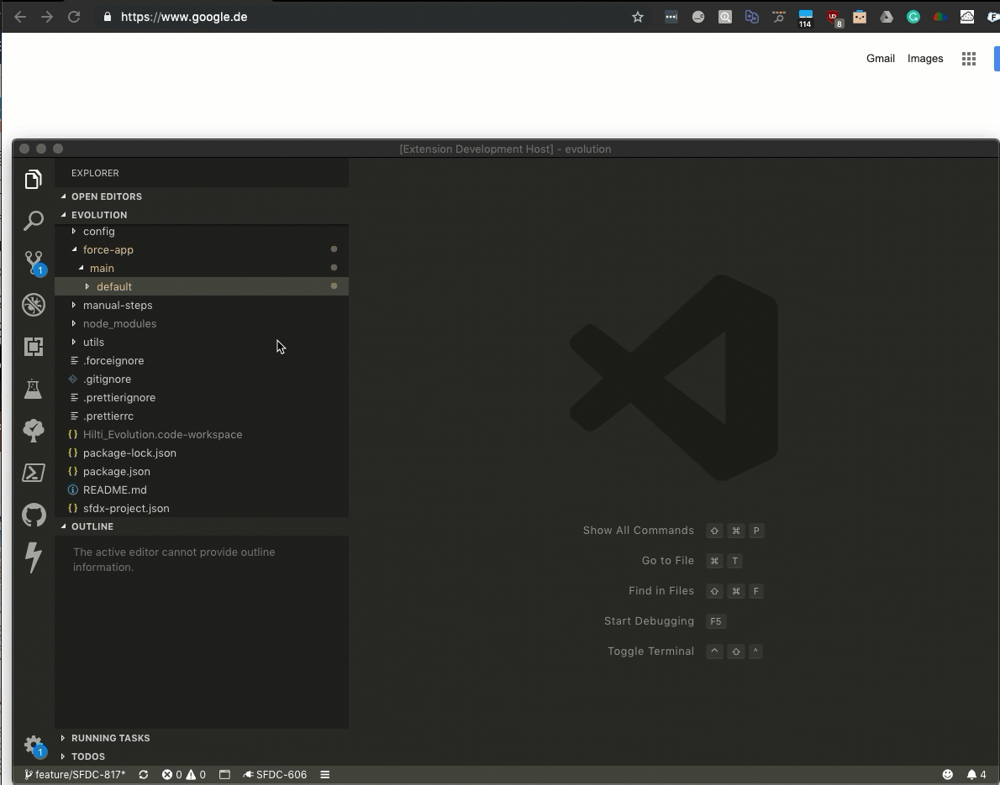
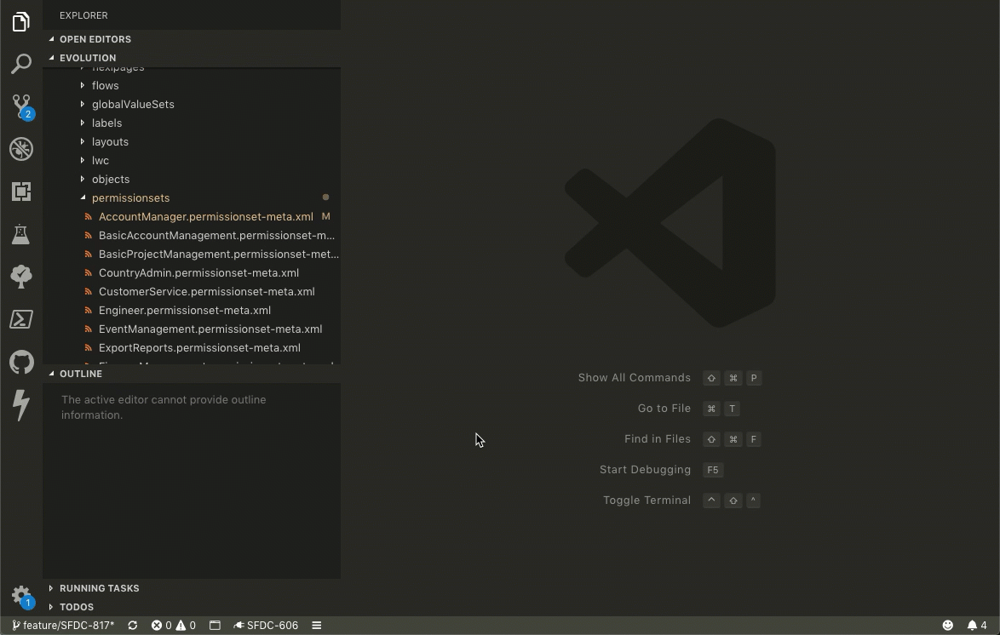

# MSK sfdx Toolbox

Simplifies development with Salesforce DX.

## Features

- **>MSK: Open Current File In Org** *Show the currently opened file in your Salesforce org via your browser (e.g. `Account-Account Layout.layout-meta.xml` opens the Page Layout Editor).* This allows you to quickly confirm how the XML file is represented in the Salesforce org.
- **>MSK: Open Org** *Open any Scratch Org, Sandbox or Dev Hub in the browser or display its expiration date.* This allows you to quickly switch between all authorized orgs and see to which Dev Hub they are related to.
- **>MSK: Delete Scratch Org** *Delete any Scratch Org.*
- **>MSK: Compare Permissions** *Intelligently compare Permission Sets or Profiles between your current branch and the `master` branch and generate a merge file.* This allows you to check for conflicts and provide a merged file before pushing your changes.
- **>MSK: Validate Changes** *Validate your local changes against any Scratch Org or Sandbox.* This allows you to check your changes before pushing them to remote.

### Demonstration
#### Opening a Metadata File in Salesforce

#### Comparing Permission Sets & Profiles

#### Validating Changes Against Any Org

<!-- ## Known Issues
Calling out known issues can help limit users opening duplicate issues against your extension. -->

## Setup

1. Open *Command Palette > Preferences: Open Settings (UI)*
2. Search for "MSK"
3. Configure `Default Working Directory` and  (optional) `Default Compare Script Directory`
4. Execute any command via *Command Palette > MSK*
5. **>MSK: Open Current File In Org** and **>MSK: Compare Permissions** can also be executed via the right-click context menu for any open file, directly from the editors action buttons or from the file explorer.

### Comparing Permissions
Permission files (Profiles or Permission Sets) can be compared against their current version on your master branch to highlight conflicts.
1. Check out your `master` branch (to compare changes against) and ensure it is up-to-date (as you want to compare against the most recent version).
2. Check out your `feature`/`development` branch (to compare changes from).
3. Use **>MSK: Compare Permissions** to select the Profile or Permission Set.
4. Receive a success message if merging concluded without conflicts or check the conflict file.

## Requirements

- **All Commands** Install the [Salesforce CLI](https://developer.salesforce.com/tools/sfdxcli).

## Other Notes

Logo taken from [Salesforce](https://partners.salesforce.com/s/education/general/Salesforce_DX).
